## Fundamentals

<iframe width="100%" height="315" src="https://www.youtube.com/embed/5NjLrnH2LfY" title="YouTube video player" frameborder="0" allow="accelerometer; autoplay; clipboard-write; encrypted-media; gyroscope; picture-in-picture; web-share" allowfullscreen></iframe>

Overview:

- Dave Harold, a Principal Security Strategist at Google Cloud, is providing an overview of the Chronicle Unified Data Model (UDM).
- This will cover the need for normalization in security analytics and how UDM normalization works in Chronicle.


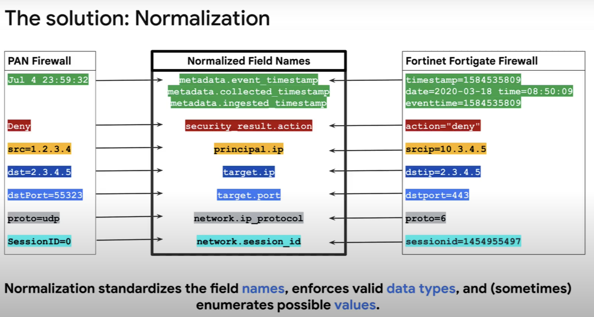

The Need for Normalization:

- Security is a data problem, organizations gather large amounts of security data daily, but there are challenges in using this security telemetry.
- The data is unstructured or multi-structured, and each source can use a different format.
- The field names can vary widely from one data source to another, making it challenging to write alerts or perform analysis.
- Therefore, a common way to represent security data is needed, starting with normalizing field names.

UDM Normalization in Chronicle:

- Chronicle uses UDM to represent security telemetry.
- Parsers within Chronicle convert raw logs into UDM.
- Normalized data is available for detection rules, search, and analytics.
- Normalization simplifies detection rules, avoids search-time field extraction, and allows for shared content repositories.
- UDM supports entity data and relationships for contextual enrichment.
- Chronicle makes normalization easy with a comprehensive structured UDM, an extensive default parser library, and support for custom log formats.

UDM Events:

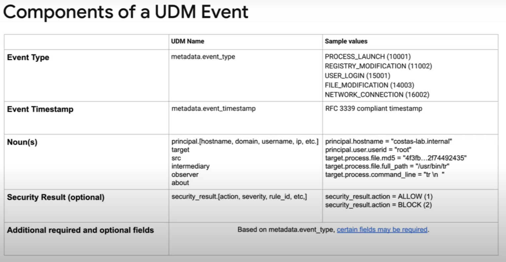

## What is Chronicle?

<iframe width="100%" height="315" src="https://www.youtube.com/embed/2IK6p6JNYIU" title="YouTube video player" frameborder="0" allow="accelerometer; autoplay; clipboard-write; encrypted-media; gyroscope; picture-in-picture; web-share" allowfullscreen></iframe>

model (UDM) for security data. It's designed to address the challenge of making sense of the large volumes of unstructured and multi-structured security data that organizations gather daily.

The advantages of Chronicle include:

- Normalization: Chronicle provides a common way to represent security data by normalizing field names and standardizing fields' values, making it easier to analyze and understand the data.

- Speed: Normalized data can be indexed, making searches in the Chronicle lightning fast.

- Shared language: Chronicle provides a common language for security telemetry, which means that security analysts can work more efficiently.

- Simplification of detection rules: By normalizing the data, product-specific terminology is abstracted away, simplifying the creation and maintenance of detection content.

- Shared content repositories: Chronicle provides access to shared content repositories containing rules written by people worldwide, which are expressed using UDM.

- Avoidance of expensive search time: By normalizing the data once at ingestion time, Chronicle avoids expensive search time field extraction found in some legacy security information and event management (SIEM) systems.

- Contextual enrichment: Chronicle supports entity data and entity relationships, which allows it to understand details about users, systems, and applications. This contextual data is then used to enrich Chronicle views and write better detection rules.

- Comprehensive: Chronicle's UDM is comprehensive and structured to capture complex events and entity data, and it ships with a large default parser library that covers hundreds of different security tools.

- Parser extensions: If a parser needs to be augmented, customers can easily add additional field normalization using parser extensions.

- Raw log search: Raw log search is available within Chronicle, so customers can search against the data just as the source system created it.

Note: YARA-L Language used for writing Chronicle rule.

## Demo

<iframe width="100%" height="315" src="https://www.youtube.com/embed/VEUTofLMQJo" title="YouTube video player" frameborder="0" allow="accelerometer; autoplay; clipboard-write; encrypted-media; gyroscope; picture-in-picture; web-share" allowfullscreen></iframe>

Chronicle Dashboards are built upon the capabilities of a looker(visual layer) and bigquery (data layer).

In the UDM Search query editor(Similar to GCP logging), you can search for structured data by using various UDM fields. The query editor also allows you to filter out specific events and adjust the date range of your search. Results are displayed in real-time, and you can also click on rows to see more detailed information. In the future, Chronicle plans to add more customization options to the raw log viewer and new features such as templates and saved queries.

Raw log searches are helpful when the information being sought may not have been ingested or normalized in Chronicle yet. To perform a raw log search, the user can go to the raw log search section, set the desired date range, specify the log source to search in, and search for the desired field. Raw log searches can also be performed using regular expressions by checking the "run query as regex" option. The results of the search will be events related to the search string and can be viewed in the raw log viewer, where the raw log string and the string match will be highlighted.

The user view displays a heat map of user behavior analytics and can be used to find information about suspicious behavior. The **IP view, Domain view**, and **filehash view** have a similar layout, prevalence chart, and insight cards, with each view having different insight cards.

Dashboard, Default is 5.

Google chronicles team provides predefined rules as Policies those could be as well as custom rules that could be added. A rule can be added on Live mode (Permissive) or Alert mode (Enforce).

## Parsing Data

Overview of Chronicle's Ingestion Service:

- Chronicle's ingestion service normalizes unstructured log data into the Unified Data Model (UDM) for increased speed of search and detection.
- Parsing is done through Logstash-style configuration files that extract, manipulate, and write data into a UDM event or entity.
- Over 500 [default parsers](https://cloud.google.com/chronicle/docs/ingestion/parser-list/supported-default-parsers) are available for standard log formats, making it easy for customers to bring their security logs and start using the platform.

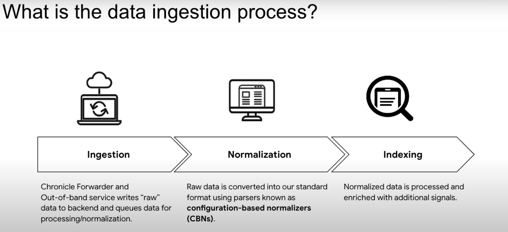


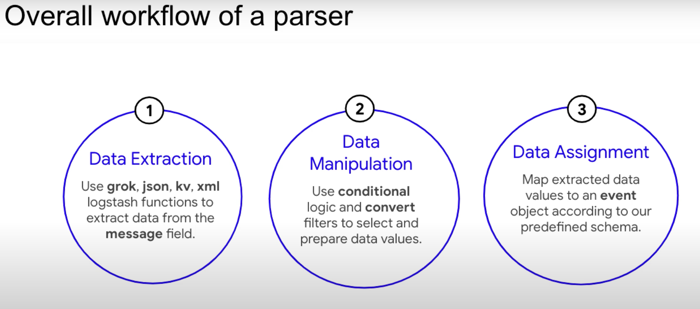

**Default Parsers:**

- Default parsers are pre-built parsers that are part of the platform and maintained by Google. They are automatically applied to events during the ingestion process if a default parser is available for the data type.
- A complete list of default parsers is available at <https://cloud.google.com/chronicle/docs/ingestion/parser-list/supported-default-parsers>.

**Custom Parsers:**

- Custom parsers are developed by the customer or partner to meet specific requirements not handled by the default parser.
- They can be applied using the Parser API or supporting tooling like CBN-tool.

**When to use Custom Parsers:**

- Custom parsers may be required in the following scenarios:
  Custom application with security logs not being a COTS product.
- Specific requirements for fields not handled by the default parser.
- Logs are not being sent in the expected format.
- No default parser is available for the application.

**Note:** In most cases, the default parser will be sufficient and provides the easiest route to parsing logs in Chronicle.

Here's an example of a basic parser for log ingestion in Chronicle:

```sql
filter {
  grok {
    match => { "message" => "%{TIMESTAMP_ISO8601:timestamp} %{LOGLEVEL:log_level} %{GREEDYDATA:message}" }
  }
  date {
    match => [ "timestamp", "ISO8601" ]
  }
}
```

This parser uses the grok filter to extract relevant information from a log message, and it matches the message field with a pattern that includes a timestamp, log level, and the actual log message. The date filter is then used to parse the extracted timestamp into a readable date format.

Here's a sample log line that this parser would process:

```Log
2022-12-01T12:34:56Z ERROR This is an error message
```

After processing, the log line will be transformed into a structured event with the following fields:

```vbnet
timestamp: 2022-12-01T12:34:56Z
log_level: ERROR
message: This is an error message
Keep in mind that this is just a basic example, and you may need to modify the parser based on the specific format of your logs.
```

**Parsing API**

Chronicles provides API for configuring parsers.

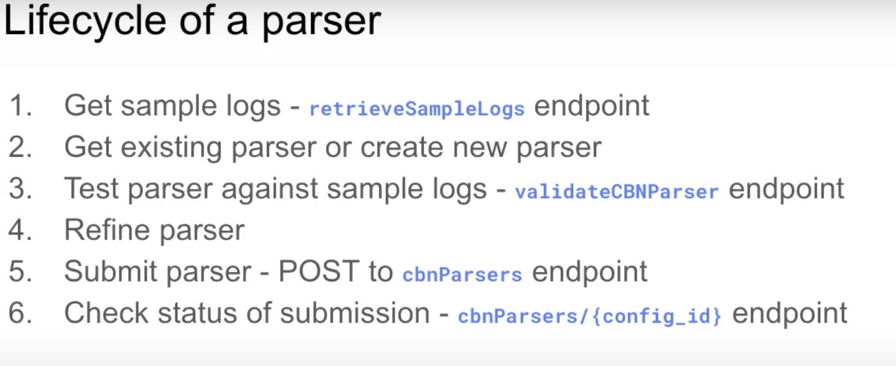

Prebuilt tool for interacting with Parser API - <https://github.com/chronicle/cbn-tool>

Getting Data: [List of Supported data / log sources
launch](https://cloud.google.com/chronicle/docs/supported-datasets)

There are four main methods of getting data into Google Chronicle:


- Chronicle forwarder.
- Pulling data from cloud sources.
- Pushing data into Chronicle through the ingestion API.
- Directly fetching log data from Google Cloud.

**Chronicle forwarder:**

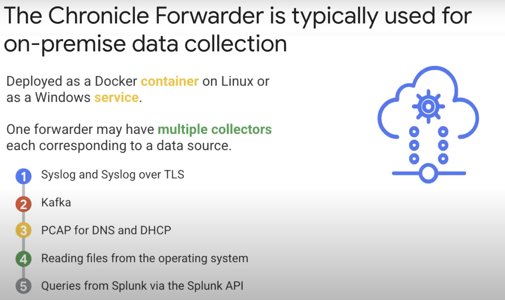

- Primarily used for gathering data from on-premises sources but can also be deployed in cloud environments.
- Deployed as a Docker container running on Linux VM (Windows version also exists).
- Supports collection of different types of data such as syslog via TLS, Kafka topics, local files, and Splunk.
- It can be deployed multiple times behind a load balancer for HA and load balancing.
- Configuration is done using a YAML file, which can be modified to add or remove data sources and log types.

**Pulling data from cloud sources:**

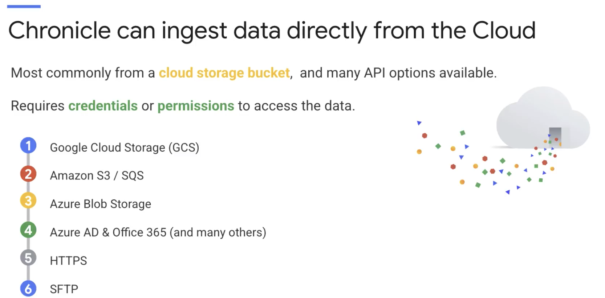

- Data from sources like GCS, S3, Azure Blob Storage, Microsoft 365, Azure Active Directory, and others can be fetched directly.
- Requires configuring API token or credentials.
- Configurable through Chronicle UI by an administrator.

**Pushing data through the ingestion API:**

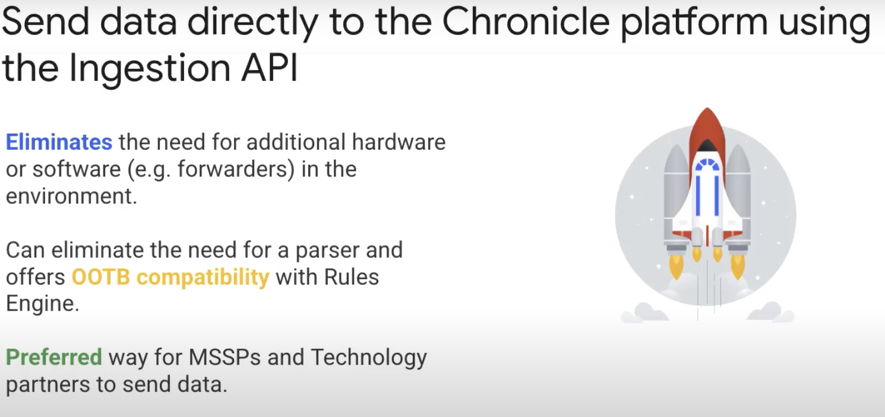

- Presents a way for partners and MSPs to send data directly to Chronicle without using forwarders or cloud source feeds.
- Four distinct endpoints, authenticated with an OAuth token.
- Endpoints allow posting data in unstructured log format or pre-formatted UDM format.

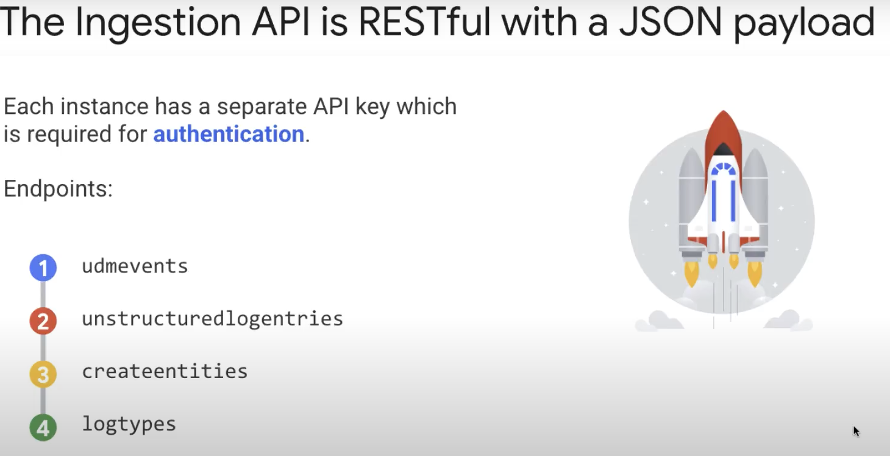

**Direct ingestion:**

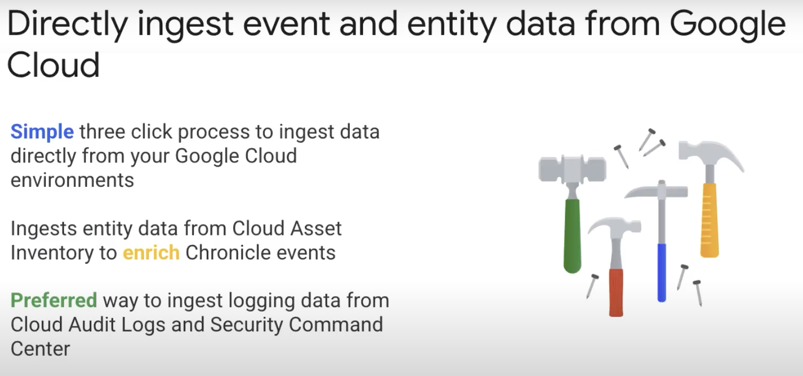

- Only applicable to Google Cloud data.
- Recently introduced in the Google Cloud console.
- Allows attaching Chronicle instance to Google Cloud subscription with a few clicks.
- Automatically enables collection of data from the Security Command Center, Cloud audit logs, and Cloud asset inventory.
- Filters allow further tuning of data.

**Reference Links**

Troubleshooting and General Errors : [Getting Data: How to guide for troubleshooting Forwarder issues / monitoring Forwarder health](<https://2567647.fs1.hubspotusercontent-na1.net/hubfs/2567647/Chronical%20Technical%20Training/Forwarder%20FAQ%20(go_forwarder-faq).pdf>)

[Getting Data: How-to guide: Overview Ingest API with example configuration
launch](https://2567647.fs1.hubspotusercontent-na1.net/hubfs/2567647/Chronical%20Technical%20Training/%5BChronicle%5D%20How%20to%20use%20the%20Ingestion%20API.pdf)

[Getting Data: Help Center on Ingestion API
](https://cloud.google.com/chronicle/docs/reference/ingestion-api)

[Supported default parsers](https://cloud.google.com/chronicle/docs/ingestion/parser-list/supported-default-parsers)

[Parsing Data: How-to: JSON parser example guide](https://2567647.fs1.hubspotusercontent-na1.net/hubfs/2567647/Chronical%20Technical%20Training/%5BChronicle%5D%20How%20to%20parse%20JSON%20data.pdf)

[Parsing Data: How-to: KeyValue example guide](<https://2567647.fs1.hubspotusercontent-na1.net/hubfs/2567647/Chronical%20Technical%20Training/%5BChronicle%5D%20How%20to%20parse%20key-value%20data%20(1).pdf>)

## Authentication

Chronicles SSO can be set up via identity providers like Google workspace, jumpcloud, octa etc.

Guides:

- [Authenication: How to guide for configuring Workspace Cloud Identity IdP](https://2567647.fs1.hubspotusercontent-na1.net/hubfs/2567647/Chronical%20Technical%20Training/%5BChronicle%5D%20How%20to%20configure%20Google%20Cloud%20Identity%20as%20a%20Chronicle%20IdP.pdf)

- [Authentication: How to guide for configuring Okta IdP](https://2567647.fs1.hubspotusercontent-na1.net/hubfs/2567647/Chronical%20Technical%20Training/%5BChronicle%5D%20How%20to%20configure%20Okta%20as%20a%20Chronicle%20IdP.pdf)

- [Authenication: How to guide for configuring Azure IdP](https://2567647.fs1.hubspotusercontent-na1.net/hubfs/2567647/Chronical%20Technical%20Training/%5BChronicle%5D%20How%20to%20configure%20Azure%20Active%20Directory%20as%20a%20Chronicle%20IdP.pdf)

### Role Based Access Control

Roles are associated with a set of product permissions. Assigning a role to a user grants the user the permissions associated with that [role](https://cloud.google.com/chronicle/docs/administration/rbac?hl=en#roles_and_permissions).

Chronicle includes the following predefined roles:

- Administrator: Manages the role-based access control policies for your enterprise. Can also edit or view any Chronicle page.
- Editor: Can edit Chronicle pages, including the ability to create and edit rules for the Detection Engine.
- Viewer: Can view any Chronicle page, but cannot make any changes.
- ViewerWithNoDetectAccess: Can view all Chronicle pages that do not include detections (principally the Rules and Reference Lists pages).

- RBAC can be assigned from Chronicles dashboard.

Reference Links:

- [Authorization: Help Center: Role-Based Access Control (RBAC)
  ](https://cloud.google.com/chronicle/docs/administration/rbac?hl=en)

## Rules

**What is YARA?**

YARA is a rule-based language used for identifying and classifying malware and other types of malicious software. It was created by Victor Alvarez of VirusTotal in 2007 and has since become a widely-used tool for detecting and analyzing malware.

YARA rules consist of a set of strings and/or regular expressions that describe certain patterns found in the files or processes being analyzed. These rules can be used to scan files, memory, and network traffic to detect malware and other malicious activity.

YARA is commonly used by malware analysts, incident responders, and security researchers to detect and analyze new strains of malware, as well as to identify patterns and characteristics of known malware families. It is an open-source tool that can be customized and extended to meet specific needs.

**What is YARA-L?**

YARA-L (YARA Language Extension) is a set of extensions to the YARA rule-based language that enables more advanced and powerful malware detection and analysis. It was developed by the cybersecurity firm ReversingLabs to address some of the limitations of the original YARA language.

YARA-L extends the original YARA language by adding new features such as improved regular expression support, advanced math functions, and the ability to define custom data types. It also includes support for more advanced file types, such as PDF and Microsoft Office documents, and allows for more granular control over the analysis of these files.

One of the key features of YARA-L is its ability to analyze and classify malware based on metadata and other non-executable file characteristics. This allows for more accurate and effective detection of malware, even in cases where the malware has been obfuscated or disguised in some way.

YARA-L is widely used by malware analysts, incident responders, and security researchers to detect and analyze new and emerging threats, as well as to identify patterns and characteristics of known malware families. It is an open-source tool that can be customized and extended to meet specific needs.

**Chronicles Uses YARA-L.**

### Creating Rules

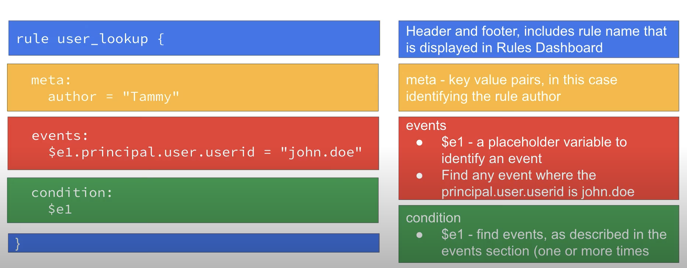

Basic Rule Syntax

```YARA
rule detect_clop_ransomware {
  meta:
    author = "Your Name"
    description = "Detects the Clop ransomware family"
  strings:
    $clop_string = "clop_marker_here"
  condition:
    $clop_string in (filedata and filesize < 10MB) and $event_type == "file-event" and ($filename matches "*.exe" or $filename matches "*.js")
}
```

This rule is designed to detect the Clop ransomware based on a unique string marker that is known to be associated with that malware. The rule uses a string variable named "$clop_string" to define the marker.

The "condition" section of the rule specifies that the marker must be found in the file data of a file event that has a file size of less than 10MB, and that the event type must be "file-event". It also specifies that the file name must match the patterns ".exe" or ".js", which are known file types used by the Clop ransomware.

<iframe width="100%" height="315" src="https://www.youtube.com/watch?v=RMDpGkLHON8" title="YouTube video player" frameborder="0" allow="accelerometer; autoplay; clipboard-write; encrypted-media; gyroscope; picture-in-picture; web-share" allowfullscreen></iframe>

Ref: [YARA-L 2.0 Syntax](https://cloud.google.com/chronicle/docs/detection/yara-l-2-0-syntax)
